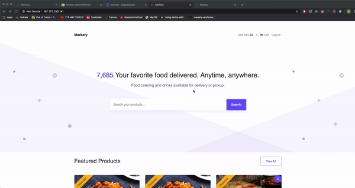

# markety-api
 an online catering marketplace that allows individuals to order food from local caterers. Tech stack includes Python-Django RESTfulAPI as the backend, React for the frontend development, Elasticsearch for queries, and Docker Containers for production deployment using Digital Ocean servers. 

# Example Application

we prepared a marketplace system, which allows creating aswell as editing products.
Each product can be commented on by users.

This example application makes use of Foreign Keys, Many-To-Many Fields, template tags, middlewares, views, etc... - a typical Django app.

# 

# 

# IN PROGRESS LIVE DEMO: https://bit.ly/2SHOADD
